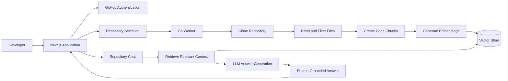
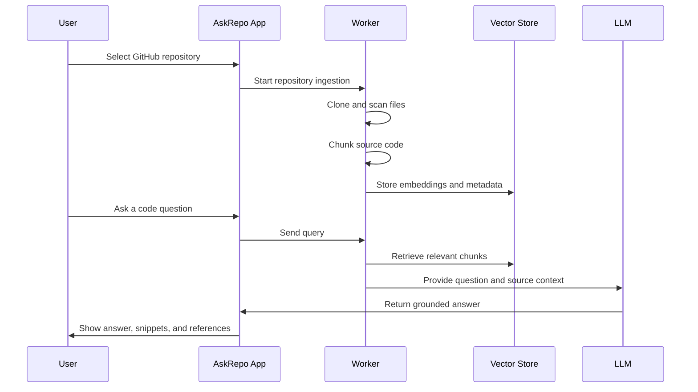
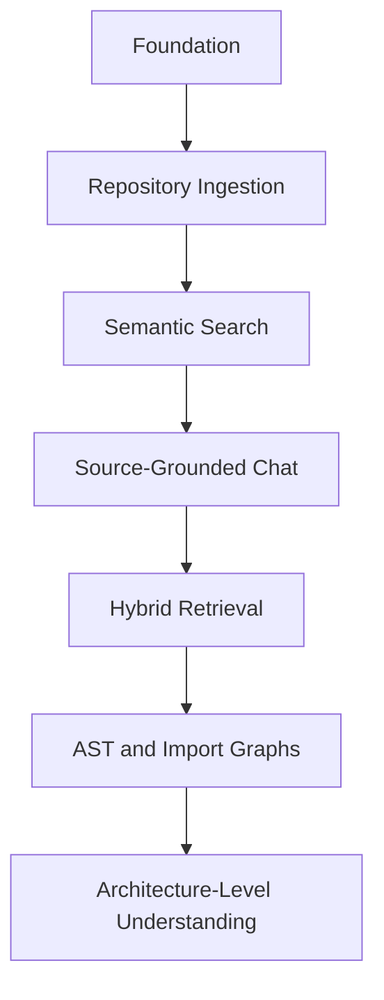

# AskRepo

AskRepo is a repository intelligence platform that helps developers understand codebases through natural-language questions. It connects to a GitHub repository, indexes the source code, retrieves relevant context, and generates answers grounded in the files, functions, and snippets that matter.

Instead of asking developers to manually inspect dozens of files, AskRepo is designed to answer questions such as:

- How does authentication work?
- Where is this API called?
- Which files are responsible for payments?
- What happens after this function runs?
- Explain the request flow from the UI to the backend.

## Table of Contents

- [Overview](#overview)
- [Architecture](#architecture)
- [Repository Structure](#repository-structure)
- [Retrieval Pipeline](#retrieval-pipeline)
- [Code Chunking](#code-chunking)
- [Answer Design](#answer-design)
- [Technology Stack](#technology-stack)
- [Getting Started](#getting-started)
- [Development Commands](#development-commands)
- [Project Roadmap](#project-roadmap)

## Overview

AskRepo is built around a simple principle: answers about a codebase should be verifiable.

The system should not send an entire repository to an LLM and hope for a useful response. It should first understand the repository structure, retrieve only the most relevant source context, and then generate an explanation that points back to the exact files and code sections used.

## Architecture

AskRepo is organized into two main layers:

- **Application layer**: the Next.js interface for repository selection, chat, answer rendering, and source inspection.
- **Worker layer**: the repository-processing engine for cloning, scanning, chunking, embedding, indexing, and retrieval.



## Repository Structure

```text
ask_repo/
|-- application/
|   |-- app/
|   |-- components/
|   |-- public/
|   |-- package.json
|   |-- next.config.ts
|   `-- tsconfig.json
|-- workers/
|   `-- main.go
`-- README.md
```

### Application

The `application/` directory contains the Next.js frontend.

Primary responsibilities:

- GitHub sign-in and session flow
- Repository selection
- Chat interface
- Answer rendering
- Source snippet display
- File, function, and line reference navigation

### Workers

The `workers/` directory is reserved for backend repository intelligence.

Primary responsibilities:

- Clone selected repositories
- Read and filter source files
- Split code into meaningful chunks
- Extract metadata from files and symbols
- Generate embeddings
- Index searchable code context
- Retrieve relevant snippets for user questions

## Retrieval Pipeline

AskRepo uses a retrieval-augmented generation workflow. The LLM is responsible for explanation, while repository search is responsible for finding the evidence.



## Code Chunking

Code should be indexed by meaning, not by arbitrary character count. A high-quality chunk preserves enough structure for the model to understand what the code does and where it belongs.

Useful chunk boundaries include:

- Functions
- Methods
- Classes
- React components
- API route handlers
- Middleware
- Services
- Utility modules
- Configuration blocks

Each chunk should retain metadata that makes answers traceable:

```json
{
  "repository": "owner/project",
  "filePath": "src/auth/service.ts",
  "symbol": "authenticateUser",
  "language": "typescript",
  "startLine": 20,
  "endLine": 75,
  "content": "..."
}
```

This metadata enables clickable files, line highlighting, snippet previews, and more reliable explanations.

## Answer Design

A strong AskRepo answer should include three things:

- A direct explanation of the code path or concept.
- The source files and snippets used as evidence.
- Clear references that allow the user to inspect the original code.

Example response shape:

```text
Authentication is handled by the request middleware before protected routes run.

Relevant sources:
- src/middleware/auth.ts: verifies the JWT and attaches the user context.
- src/auth/service.ts: validates credentials and creates sessions.
- src/routes/login.ts: receives login requests and calls the auth service.

Flow:
1. The login route receives credentials.
2. The auth service validates the user.
3. A signed token is created.
4. Middleware verifies the token on protected requests.
```

## Technology Stack

| Area | Technology |
| --- | --- |
| Frontend | Next.js, React, TypeScript |
| Styling | Tailwind CSS |
| Backend worker | Go |
| Repository provider | GitHub |
| Search | Semantic and hybrid retrieval |
| Storage | PostgreSQL and vector search |
| AI layer | Embeddings and LLM-generated explanations |

## Getting Started

Install frontend dependencies:

```bash
cd application
npm install
```

Start the development server:

```bash
npm run dev
```

Open the local URL shown in the terminal:

```text
http://localhost:3000
```

## Development Commands

Run these commands from the `application/` directory.

| Command | Description |
| --- | --- |
| `npm run dev` | Start the Next.js development server |
| `npm run build` | Build the application for production |
| `npm run start` | Start the production server |
| `npm run lint` | Run ESLint |

## Project Roadmap



### Foundation

- Product interface
- Repository connection flow
- Basic chat experience
- Source reference UI

### Repository Intelligence

- Repository cloning
- File filtering
- Logical code chunking
- Metadata extraction
- Embedding generation
- Semantic retrieval

### Advanced Understanding

- Hybrid keyword and vector search
- Result reranking
- AST parsing
- Import graph generation
- Function call graph generation
- Multi-file flow tracing

## Guiding Principle

AskRepo should make codebase understanding faster without hiding the source of truth. Every generated explanation should be backed by repository evidence that the developer can inspect directly.
